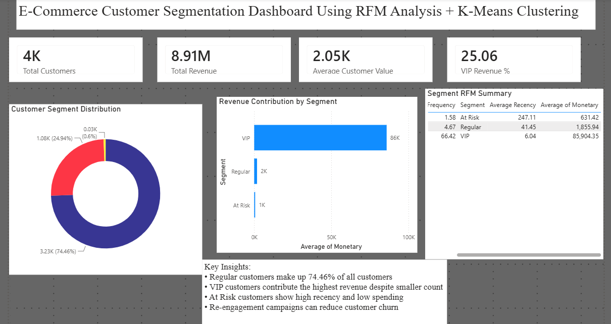

E-Commerce Customer Segmentation using RFM & K-Means

## Project Overview
This project performs customer segmentation using RFM analysis and K-Means clustering to classify customers into:
- VIP Customers
- Regular Customers
- At-Risk Customers

The goal is to help businesses understand customer behavior and improve decision-making.

## Tech Stack
- Python
- Pandas
- NumPy
- Power BI
- Jupyter Notebook

## Workflow
1. Data Cleaning
2. Feature Engineering
3. RFM Analysis
4. K-Means Clustering
5. Customer Segmentation
6. Dashboard Creation in Power BI

## Dashboard Preview

## Key Insights
- Regular customers make up 74.46% of total customers
- VIP customers generate highest revenue despite low population
- At-risk customers show high recency and low spending
- Retention campaigns can reduce churn

## Files
- customer_segmentation.ipynb → Python analysis
- customer_segmentation_dashboard.pbix → Power BI dashboard
- Online Retail.xlsx → Dataset
